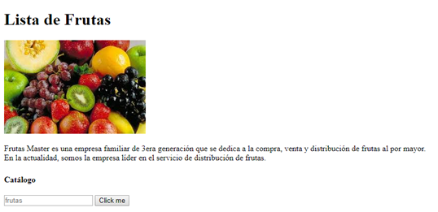
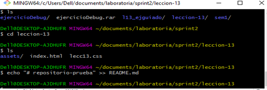
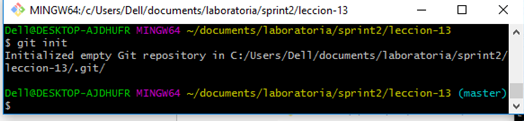
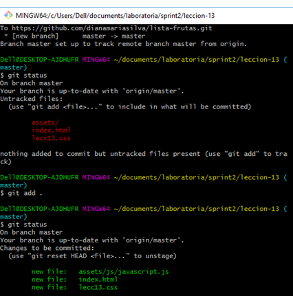

# repositorio-prueba
###**APRENDIENDO A USAR GIT Y GITHUB**

*Empezando con un ejercicio de Lista de frutas*

> Creando carpetas y archivos

1 Crear carpeta llamada lección-13

2 Dentro de esa carpeta crear un HTML llamado "index.html" y una carpeta llamada "assets"

3 Ingresando en la carpeta "assets" añadir un archivo js llamado "javascript"

> Descripción breve de las cosas hechas en HTML, JS

* En HTML...
	
	
	1 Poner tanto título de página como encabezado "Lista de frutas" en <HEAD>

	2 Añadir una imagen en HTML en la parte <body>

	3 Agregar titulo y descripción en <body>

	4 Agregar un contenedor "
" donde debe almacenar lista de frutas y como título tiene "Catálogo"

		* Añadir un botón y al costado izquierdo un espacio, el cual contaba con placeholder (como palabra oculta puse "fruta")

* Crear un css con un fondo 

* Crear un js 

***

> Pasos usados en Git y GitHub

1 Crear un repositorio llamado "lista.frutas" sin README EN GitHub

2 Abrir Git Bash e ingresar a la carpeta donde estará tu repositorio 
	 

3 Inicializar con comando init
	

4 Crear el README 
	 

5 Añadir archivos
	 

6 Hacer commit

	*$ git commit -m""

7 Para actualizar todo

	*$ git push

